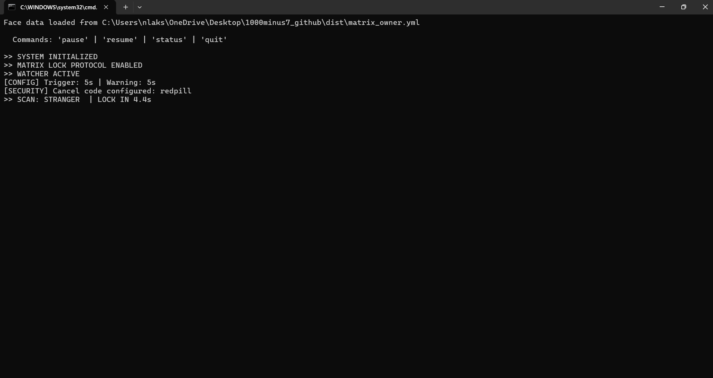
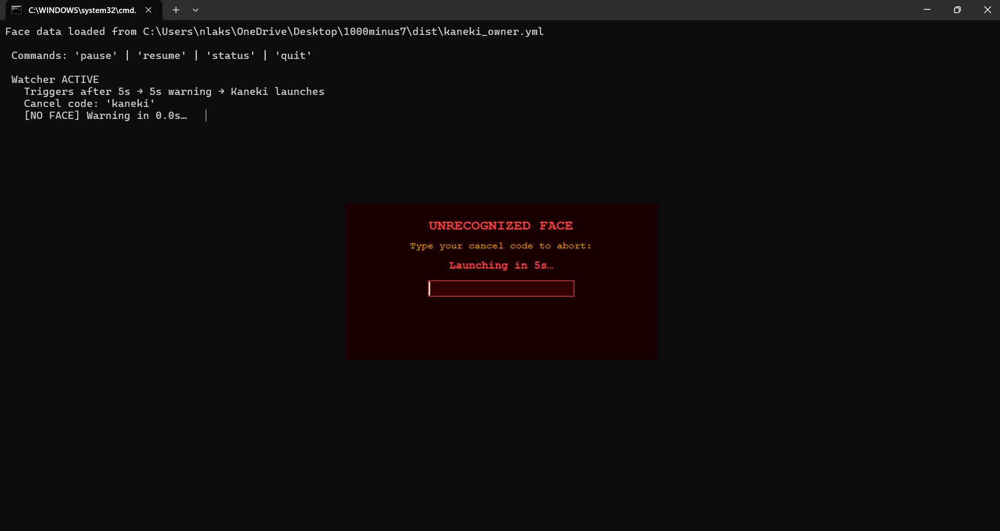

# Stranger Danger 

Real-time facial authentication system that automatically locks your screen when an unrecognized face is detected.

Built using OpenCV, this project focuses on local, privacy-first monitoring to prevent unauthorized access to your device.

---

## Overview

Originally built as a personal privacy experiment, this project evolved into a real-time monitoring system using classical computer vision techniques.

Stranger Danger runs in the background and continuously monitors your webcam feed. When an unknown face or no face is detected for a defined duration, the system initiates a warning sequence followed by a full-screen lock mechanism.

The system is fully local, requires no cloud services, and stores all facial data on-device.

---

## Features

- Real-time face recognition using OpenCV (LBPH algorithm)
- Dual-session enrollment (with and without glasses)
- Configurable detection delay and warning countdown
- Fullscreen lock mechanism with enforced input
- Secure unlock via user-defined code
- Background execution with terminal controls
- Optional auto-start on Windows boot

---


## Demo

> The following screenshots illustrate key stages of the system during runtime.

### Face Detection


### Warning Prompt


Due to the fullscreen lock behavior, the lock interface cannot be reliably captured using standard screenshot or screen recording tools.
Once triggered, the system takes over the screen and requires the correct code to regain access.

---

## Requirements

- Python 3.8+
- Windows OS (uses OS-specific locking behavior)
- Webcam

Install dependencies:

```bash
pip install opencv-contrib-python pygame pyttsx3 numpy
```

---

## Setup

### 1. Clone the repository

```bash
git clone https://github.com/LakshanyaaN/stranger-danger.git
cd stranger-danger
```

### 2. Configure your unlock code

Edit the following files and replace the placeholder value:

```python
CANCEL_CODE = "your_code_here"
```
> Note: For better security, consider storing sensitive values using environment variables instead of hardcoding.

Ensure the same code is used consistently across:
- `kaneki_watcher.py`
- `kaneki_countdown.py`

> Recommended: Use a strong, non-trivial code.

---

### 3. Build the countdown executable

```bash
pyinstaller kaneki_countdown.spec
```

This generates an executable inside the `dist/` directory.

---

### 4. Prepare runtime directory

Move `kaneki_watcher.py` into the `dist/` folder so both components reside together.

---

### 5. Run the system

```bash
cd dist
python kaneki_watcher.py
```

On first launch, the system will guide you through face enrollment.

---

## Usage

While the watcher is running, the following terminal commands are available:

| Command | Action |
|--------|--------|
| `pause` | Temporarily disable monitoring |
| `resume` | Re-enable monitoring |
| `status` | Check current system state |
| `quit` | Terminate the program |

---

## How It Works

```
Webcam feed monitored continuously
        ↓
Unknown face or absence detected
        ↓
Trigger delay threshold reached
        ↓
Warning prompt displayed
        ↓
No user response
        ↓
Fullscreen lock sequence activated
        ↓
System remains locked until correct code is entered
```

---

## Configuration

| Setting | Location | Default |
|--------|--------|--------|
| Detection delay | `kaneki_watcher.py` | 5 seconds |
| Warning duration | `kaneki_watcher.py` | 5 seconds |
| Face confidence threshold | `kaneki_watcher.py` | 70 |
| Countdown start value | `kaneki_countdown.py` | 1000 |
| Countdown step | `kaneki_countdown.py` | 7 |

---

## Architecture

- **OpenCV**: Face detection and LBPH recognition
- **Python threading**: Background monitoring loop
- **PyGame**: Fullscreen lock interface
- **PyInstaller**: Packaging executable for deployment
- The system operates at approximately ~6 FPS to balance responsiveness and CPU usage on standard hardware

---

## Limitations

- Performance depends on lighting and camera quality
- Accuracy may degrade with significant appearance changes
- Not resistant to spoofing (e.g., photos or videos)
- Requires continuous webcam access
- Windows-only due to system-level behavior
- The fullscreen lock/countdown interface may not be reliably captured via standard screen recording or screenshot tools due to its rendering behavior
---

## Security Notes

- This is not a replacement for OS-level authentication
- Face recognition is not foolproof and can be bypassed
- Use a strong unlock code for better protection
- All data is stored locally and never transmitted externally

---

## Data Privacy

- Facial data is stored locally in `kaneki_owner.yml`
- No cloud processing or external APIs are used
- Delete the file to reset enrollment

---

## Auto-start on Boot

To run the system automatically on startup:

1. Update the path in `run_kaneki.bat`
2. Press `Win + R`, type `shell:startup`
3. Place the `.bat` file in the startup folder

---

## Inspiration

In Tokyo Ghoul, Ken Kaneki is subjected to repeated torture and conditioned to count down from 1000 in decrements of 7 to preserve his sanity. This project adapts that sequence as its lockdown mechanism; an accelerating, fullscreen number cascade designed to disorient and deny access.

---

## License

MIT License : free to use, modify, and distribute.

Built by [Lakshanya](https://github.com/LakshanyaaN)
